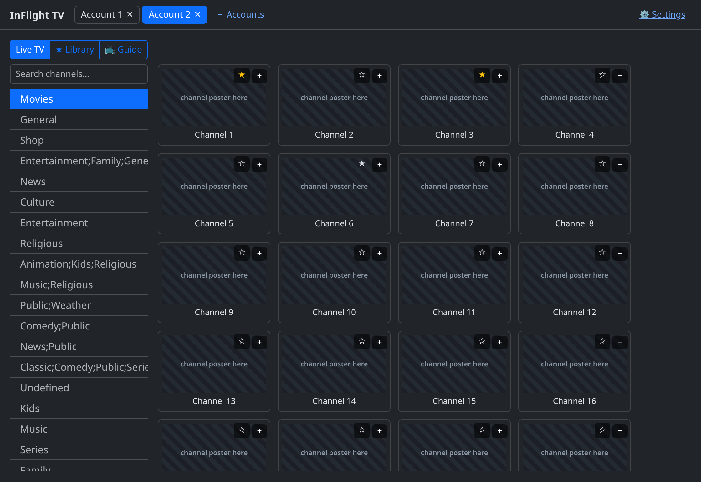
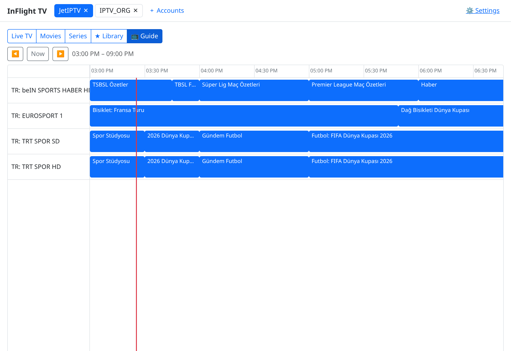
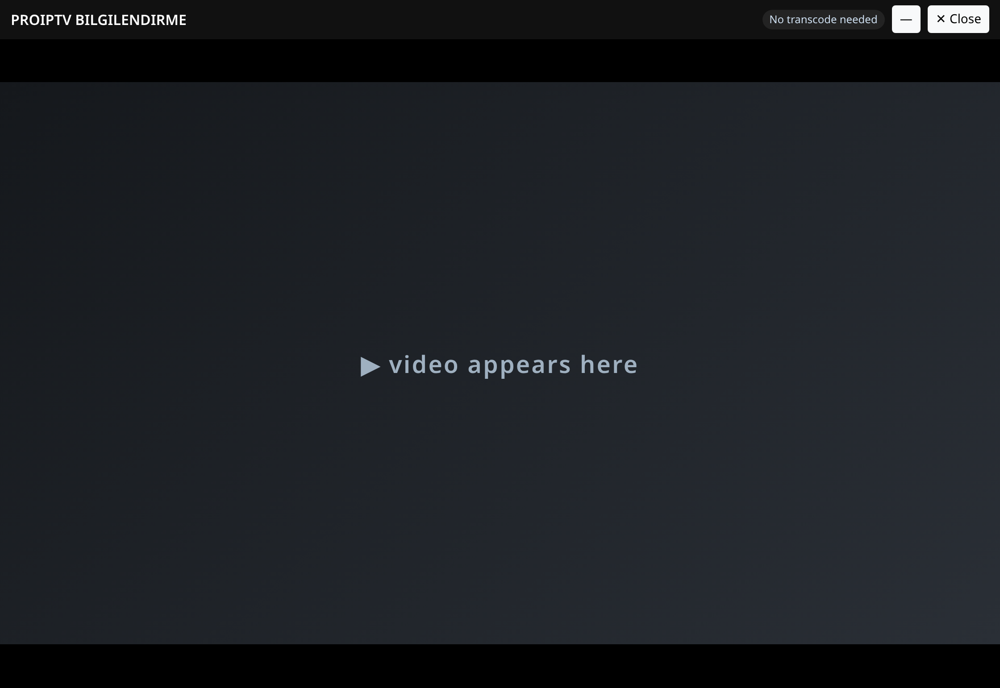
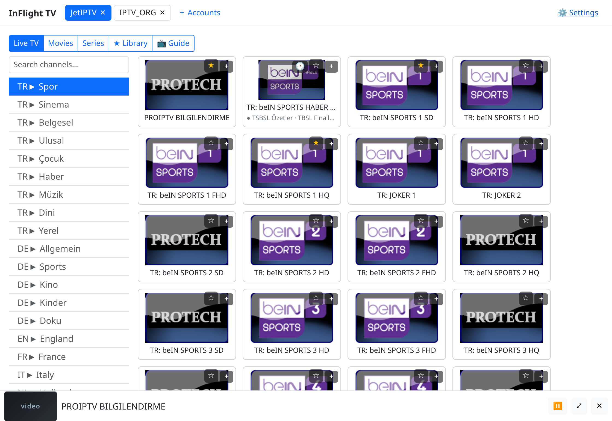
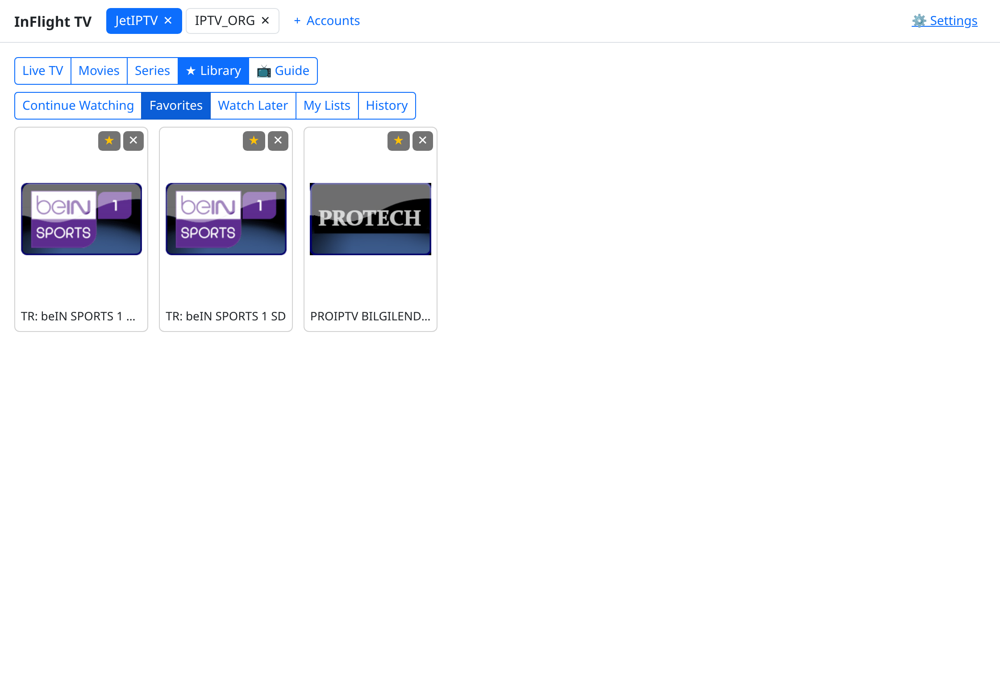
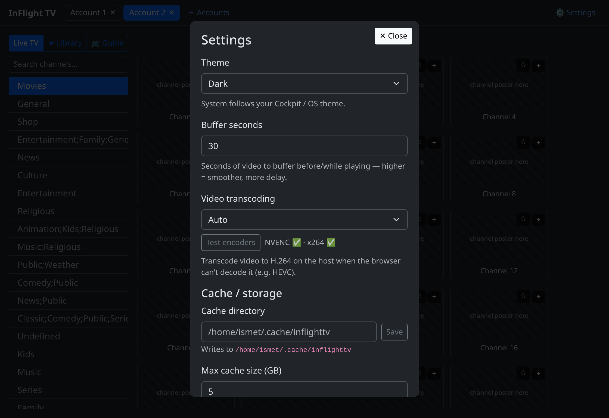

# InFlight TV — a Cockpit IPTV client plugin

InFlight TV turns [Cockpit](https://cockpit-project.org/)'s web console into a
full **IPTV client** for your server — Live TV, movies, series, an EPG guide,
and a personal library, streamed straight to your browser. Point it at an
**Xtream Codes** subscription or an **M3U** playlist and watch without leaving
Cockpit or installing a set-top app. Playback is remuxed/transcoded on the host
with `ffmpeg` (the browser only ever sees plain HLS), so it plays codecs the
browser can't decode on its own.

> Named for Cockpit ("in-flight"). It is **not** for aircraft use.

> 👉 **Check out my other plugins:**
> - **[Explorer](https://github.com/ismetozalp/explorer)** — a Cockpit plugin that turns the
>   web console into a full file manager: browse, edit, preview, search, terminals, and Git,
>   plus fstab/mounts, SMB & NFS shares, and a GRUB editor.
> - **[ctop](https://github.com/ismetozalp/ctop)** — a Cockpit plugin for real-time system
>   and process monitoring, right from the web console.
> - **[Manifest](https://github.com/ismetozalp/manifest)** — a Cockpit plugin that drives a
>   per-user `aria2c` daemon as one unified download manager for torrents, magnets, and
>   HTTP/FTP/Metalink files.

**Highlights**

- 📺 **Live TV, Movies & Series** from Xtream Codes panels or M3U playlists —
  categories, search, channel logos, and instant playback.
- 🗓️ **EPG / TV guide** — now/next on live channels plus a full **channel × time
  guide grid**, from a per-account XMLTV source (auto-detected from the Xtream panel
  or playlist, or set manually per account; name-matched to your channels).
- 👥 **Multiple accounts in tabs** — open several providers at once. Each account
  keeps its **own single connection**; play on one while another keeps running.
- 🔽 **Minimizable player** — dock playback to a bottom bar and keep browsing
  while it plays; restore to full anytime. Seek bar for movies/episodes.
- 🎞️ **Host-side transcoding** — copies H.264 as-is; transcodes what the browser
  can't decode (e.g. HEVC), trying **GPU (NVENC)** first, then **CPU (x264)**.
- 🔊 **Audio & subtitle tracks** — pick the language / subtitle stream per title.
- ⭐ **Personal library** — favorites, custom lists, watch-later, **continue
  watching** (resume where you left off), and history.
- 💾 **Cache & backup** — a relocatable, size-capped segment cache, a persistent
  **poster/logo cache** (the grid loads instantly on later visits), and an
  **encrypted backup** you can export/import (accounts + settings + library, and
  optionally the cached posters so a restored install is fast right away).
- 🎨 **Light / Dark / System theme**, following your Cockpit / OS theme.

Everything runs through Cockpit's own bridge (`cockpit.spawn`/`cockpit.file`);
there's no extra server daemon. The plugin targets
`/usr/share/cockpit/inflighttv/`.

---

## Disclaimer

This project was generated with AI (Anthropic's Claude Opus models). It's
something built for personal use and shared as-is — nothing more. There are
**no guarantees** of any kind: it may have bugs, and it's provided without
warranty.

You're welcome to open tickets for bug fixes or feature requests, but please
understand there's **no promise that they'll be answered or acted on** — this
isn't a maintained product, just a personal project.

You are free to do whatever you like with it — use it, modify it, fork it,
redistribute it. **Bring your own IPTV subscription / playlist**; none is
included, and this project is not affiliated with any provider.

---

## Screenshots

> Real screenshots (dark theme), with identifying content anonymized: account and
> channel names are generic ("Account 1", "Channel 1"…), channel logos show a
> **"channel poster here"** placeholder, and the video image is replaced with
> **"video appears here"** — no real stream, provider, or account details are shown.

**Live TV — channel grid with now/next EPG**



Categories on the left, channels as cards with logos and a ● now/next line where
guide data is matched. ★ favorites and ＋ add-to-list are on every card.

**EPG — channel × time guide grid**



A scrollable guide: channels down the side, a time axis across the top,
programme blocks positioned by start/duration, with a live "now" marker. Click a
programme to see details and play the channel.

**Player + minimizable bottom bar**



The full player shows the transcode status ("No transcode needed" / GPU / CPU),
a minimize (—) button, and Close. Minimize it and keep browsing while it plays:



The docked bar (bottom) keeps the stream playing — title, play/pause, restore,
close — while the rest of the app stays fully interactive.

**Library — favorites, lists, continue-watching, history**



**Settings — theme, buffer, transcoding, cache, backup**



Pick the theme, buffer size, transcoding mode (with an encoder self-test), the
cache directory + size cap, and export/import an encrypted backup (optionally
including the cached posters). The TV guide URL is set per account, not here.

---

## Requirements

- **Cockpit ≥ 215** on the server.
- **`ffmpeg`** on the host (stream remux + transcode). For GPU transcoding, an
  NVENC-capable NVIDIA setup (`ffmpeg` built with `h264_nvenc`); otherwise it
  falls back to CPU `libx264`.
- **`curl`** on the host (used to fetch the upstream stream).
- **Node ≥ 20** to build from source.

## Install

Two steps: install Cockpit (if you haven't), then drop the plugin into Cockpit's
package path.

### 1. Install Cockpit

**Fedora / RHEL / Rocky / Alma / CentOS Stream**
```bash
sudo dnf install cockpit
sudo systemctl enable --now cockpit.socket
sudo firewall-cmd --add-service=cockpit --permanent && sudo firewall-cmd --reload
```

**Debian / Ubuntu / derivatives**
```bash
sudo apt update && sudo apt install cockpit
sudo systemctl enable --now cockpit.socket
# If UFW is enabled: sudo ufw allow 9090/tcp
```

**Arch / Manjaro**
```bash
sudo pacman -S cockpit
sudo systemctl enable --now cockpit.socket
```

**openSUSE Tumbleweed / Leap**
```bash
sudo zypper install cockpit
sudo systemctl enable --now cockpit.socket
sudo firewall-cmd --permanent --add-service=cockpit && sudo firewall-cmd --reload
```

Then open `https://<server-ip>:9090` and log in with any local Linux account
(the self-signed cert warning is expected).

### 2. Install ffmpeg (required for playback)

InFlight TV remuxes/transcodes every stream on the host with `ffmpeg` (plus
`curl`), so the browser only ever receives plain HLS. Install it per distro:

**Fedora**
```bash
sudo dnf install ffmpeg   # (enable RPM Fusion first if needed — see below)
```

**RHEL / Rocky / Alma / CentOS Stream** — `ffmpeg` lives in RPM Fusion:
```bash
sudo dnf install https://mirrors.rpmfusion.org/free/el/rpmfusion-free-release-$(rpm -E %rhel).noarch.rpm
sudo dnf install ffmpeg
```

**Debian / Ubuntu / derivatives**
```bash
sudo apt install ffmpeg curl
```

**Arch / Manjaro**
```bash
sudo pacman -S ffmpeg curl
```

**openSUSE (Tumbleweed / Leap)** — the full `ffmpeg` comes from the community **Packman**
*repository* (a repo — not the Arch `pacman` command). Enable it once if you haven't
(`YaST → Software Repositories → Add → Community Repositories → Packman`), then:
```bash
sudo zypper install ffmpeg curl
```

**GPU (NVENC) transcoding is optional.** For hardware H.264 encoding you need the
NVIDIA driver and an `ffmpeg` built with `h264_nvenc`. Check with
`ffmpeg -encoders | grep nvenc`. If it's missing, InFlight TV automatically falls
back to CPU (`libx264`) — nothing to configure. Settings → **Video transcoding →
Test encoders** shows exactly what your host supports.

### 3. Install the InFlight TV plugin

From a release zip:
```bash
unzip inflighttv-<version>.zip -d /tmp/
sudo cp -r /tmp/inflighttv /usr/share/cockpit/inflighttv
sudo systemctl try-restart cockpit
```

Or from source with the Makefile (it builds `dist/` with Vite, then installs it):
```bash
make build              # npm ci && npm run build  →  dist/
sudo make install       # → /usr/share/cockpit/inflighttv
sudo make uninstall     # remove
make zip                # produce inflighttv-<version>.zip
make publish            # build + publish a GitHub release (needs gh)
make help               # list all targets
```

Reload Cockpit in the browser and look under **Tools → InFlight TV**. Add your
Xtream account or M3U URL under **＋ Accounts**.

## Updating

InFlight TV can update itself from its GitHub releases.

- The version **badge** in the top-right (e.g. **IF TV v1.0.0**) checks for updates
  when clicked. If a newer release exists it asks to confirm, then downloads it,
  installs it — streaming the progress in a dialog — and restarts Cockpit. A small
  dot on the badge means an update was found by the silent check that runs shortly
  after load.
- **Settings → Plugin update** does the same and lets you set the source repo
  (default **`ismetozalp/iftv`**), see the installed version, and watch the install
  log. **Update & restart Cockpit** applies it.

The update downloads the release's `inflighttv-<version>.zip`, copies it into
`/usr/share/cockpit/inflighttv/` (Cockpit will prompt for admin rights), and
restarts Cockpit — reload the page once it returns. It never touches your saved
accounts or settings. Requires `curl` (and uses the GitHub CLI `gh` if present).

## Develop

```bash
make dev-link       # build dist/ + symlink it into ~/.local/share/cockpit (no root)
npm run dev:watch   # rebuild on save — reload the Cockpit tab to see changes
```

## Test

```bash
npm run test        # unit tests (Vitest)
npm run typecheck   # vue-tsc
npm run test:smoke  # SPA smoke (Playwright)
make test           # test + typecheck
```

## License

Apache-2.0.
